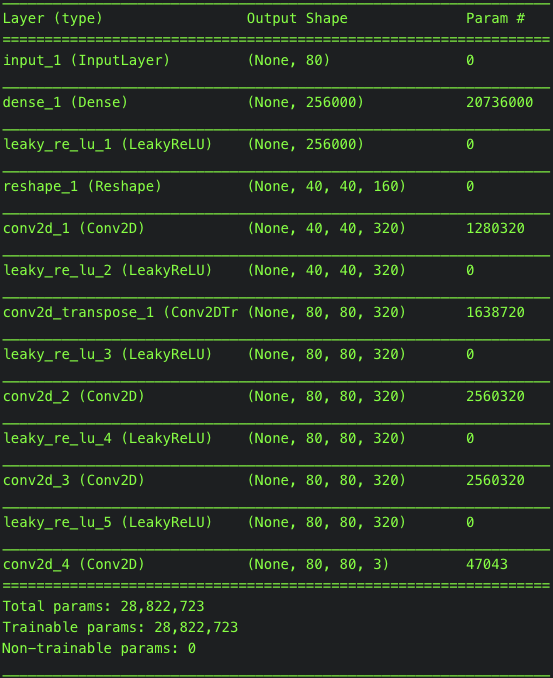
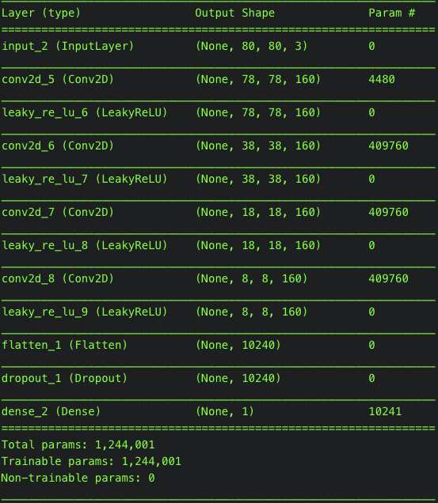
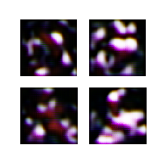
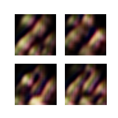
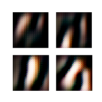

# Video Game Character Creator GAN
Hello there! This is our project for the UNLV CS 489 Introduction to Machine Learning Course!  

Team Members:  
Eric Becerril-Blas    <Github: https://github.com/lordbecerril>   
Itzel Becerril        <Github: https://github.com/HadidBuilds>    
Erving Marure Sosa    <Github: https://eems20.github.io/>         

## Purpose
Not only is this for a grade but it serves as a way for us to learn deep learning and how to create a GAN since it looks like we won't be covering it much in class. GANS are hot in the field of deep learning. We are focusing on implementing a Deep Convolutional GAN (DCGAN). A good paper we are using to aid in this endeavor is [Unsupervised Representation Learning with Deep Convolutional Generative Adversarial Networks](https://arxiv.org/abs/1511.06434)  

## What data did we use for this?
Well, we had to create our own dataset. We did this by scraping the [Game Art HQ Character Database](http://www.game-art-hq.com/52702/the-game-art-hq/). Our scraper can be found in the *VideoGameCharacterScraper* directory of this repository. The data itself can be found in the Data directory. A sample of it can be seen below:

There were a total of 1432 images, each of size 80x80 pixels  
 
In the Data directory there is train_data which has 3 folders.  
1. rgb_images: Hold the images in RGB format
2. grayscale_images: Hold the images in grayscale
3. csv_files: convert the gray scale images into CSV format
  
We are using data from the RGB images folder for this project

## So how are we doing this?
So we are still in the process. Will update this part as we move forward. Our main script is *VGC_GAN.py*. We plan on utilizing an Amazon Web Services Deep Learning AMI EC2 instance. We are using the Python programming language and the Keras libraries. 
 
Our Generator Architecture is as follows:

Notice the convolution layers. Pretty cool stuff.
 

Our Discriminator Architecture is as follows:

 

Our training configuration is to run 10,000 iterations of batches of size 40. We have no reason for this at the moment, just playing around with numbers. We ran this on Eric's machine to test it out. A 2017 Macbook Air. After about 7 hours, it was at 194 iterations. We killed the script and looked at the outputs. We saved matplotlib plots every 10 iterations. This can be seen in the *train_output* directory. Here are some of our favorites: 

Weights are saved in *model.h5*  

We are excited to see the outputs once we move over to AWS!

## Resources
[Boost Your Machine Learning with Amazon EC2, Keras, and GPU Acceleration](https://towardsdatascience.com/boost-your-machine-learning-with-amazon-ec2-keras-and-gpu-acceleration-a43aed049a50)
