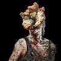

# CharacterScraper
The Scraper used to build our  database is in here under GameCharacterScraper.py. Resizing, gray scaling, and converting to CSV is done in ProcessData.py.  

Not the best scraper in the world, could use some improvements...  

Things to change: 
- Remove Hardcoded URLS (All URLS are the same. There is a way to get the inner HTML hrefs of the Letter on the side panel)  
- This script gets ALLLLL images from the page it is on... this includes the side panel images so need to go through and clean dataset. There is a way to just get images located in tbody of the HTML. ~885 images had to be removed during the cleaning process.
- Just saves images, not sure if we need to label them...

